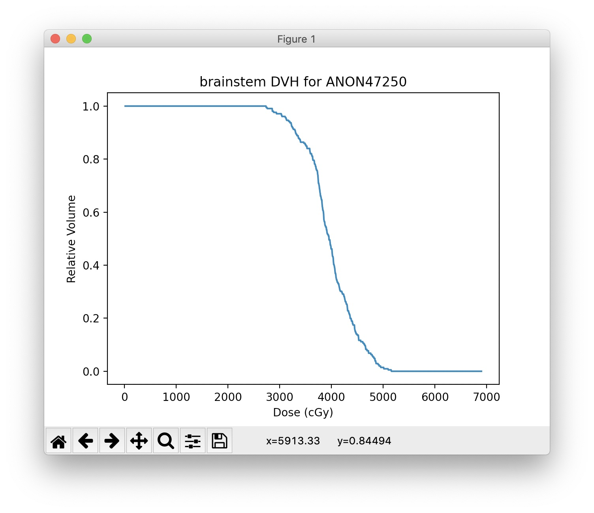
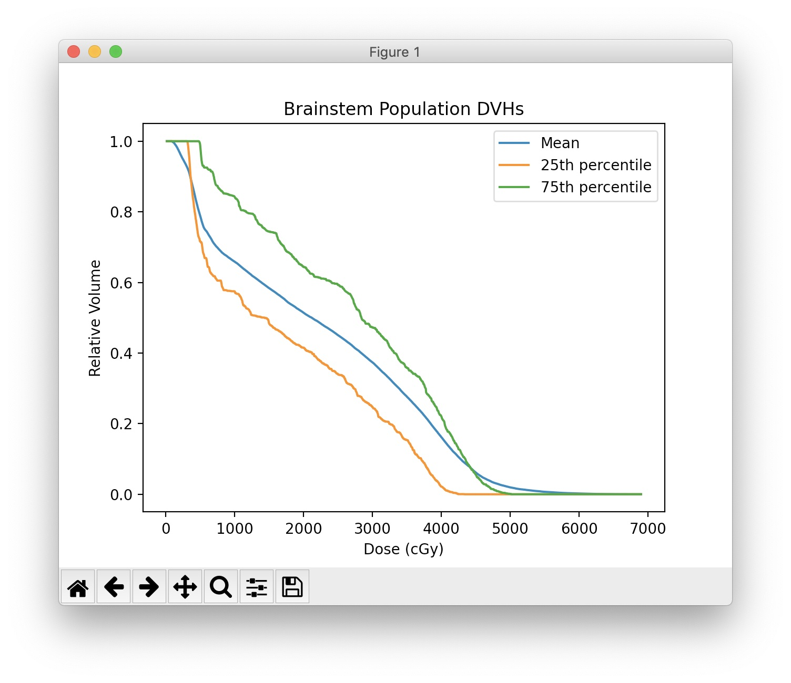
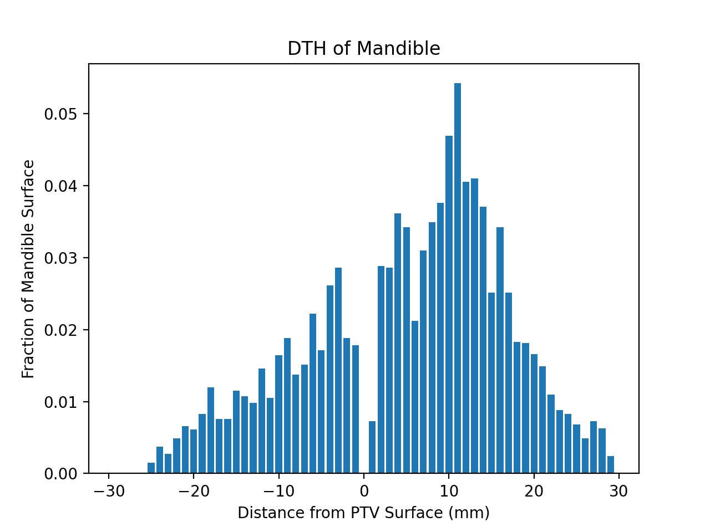

Usage
=====

Database Connection
-------------------
Assuming you've setup a successful connection and imported data through the
GUI, you can connect to the SQL database with the ``DVH_SQL`` class object.
This level of interaction with DVHA requires basic knowledge of SQL.
Refer to :ref:`datadictionary` for table and column names.

Below is an example SQL statement requesting a table with column headers of
mrn, roi_name, and dvh_string such that the physician_roi is 'brainstem'.

.. code-block:: console

    SELECT mrn, roi_name, dvh_string FROM DVHs WHERE physician_roi = 'brainstem';

The equivalent code in python:

.. code-block:: python

    from dvha.db.sql_connector import DVH_SQL

    table = 'DVHs'
    columns = 'mrn, roi_name, dvh_string'
    condition = "physician_roi = 'brainstem'"

    with DVH_SQL() as cnx:
        mandible = cnx.query(table, columns, condition)

The ``with`` block is equivalent to:

.. code-block:: python

    cnx = DVH_SQL()
    mandible = cnx.query(table, columns, condition)
    cnx.close()

If no parameters are provided to ``DVH_SQL``, it will automatically pick up
your Group 1 connection settings last used in the GUI. See the
:meth:`dvha.db.sql_connector.DVH_SQL` documentation for custom connection
settings.

QuerySQL
--------
Use :meth:`dvha.db.sql_to_python.QuerySQL` if you'd like to query a table and
automatically convert the results into a python object more convenient than
the a list of lists (as in DVH_SQL.query). The equivalent of the previous
example, using ``QuerySQL`` is below:

.. code-block:: python

    from dvha.db.sql_to_python import QuerySQL
    table = 'DVHs'
    columns = ['mrn', 'roi_name', 'dvh_string']
    condition = "physician_roi = 'brainstem'"
    data = QuerySQL(table, condition, columns=columns)

Or if you'd like to just pick up all columns:

.. code-block:: python

    data = QuerySQL(table, condition)

``QuerySQL`` automatically adds properties based on the column name. So the
`mrns` are accessible with `data.mrns`, `roi_name` with `data.roi_name`, etc.
This works with DVHs, Plans, Rxs, and Beams tables.

DVH
---

Some data you may want with each of your DVHs is spread across multiple tables.
The :meth:`dvha.models.dvh.DVH` object uses :meth:`dvha.db.sql_to_python.QuerySQL`
to query the database, adds some pertinent data from other tables, and provides
many commonly used functions dealing with DVHs.

The equivalent of the previous example, using ``DVH`` is below:

.. code-block:: python

    from dvha.models.dvh import DVH
    dvh = DVH(condition="physician_roi = 'brainstem'")

DVH Plotting
------------

.. code-block:: python

    # Collect the plotting data
    i = 0  # change this index to pick a different DVH
    x = dvh.x_data[i]
    y = dvh.y_data[i]
    mrn = dvh.mrn[i]
    roi_name = dvh.roi_name[i]
    title = '%s DVH for %s' % (roi_name, mrn)

    # Create the plot, may need to call plt.show() on some setups
    plt.plot(x, y)
    plt.title(title)
    plt.xlabel('Dose (cGy)')
    plt.ylabel('Relative Volume')

|dvh|

Population DVH
--------------

.. code-block:: python

    x = dvh.x_data[0]
    mean = dvh.get_stat_dvh('mean')
    q1 = dvh.get_percentile_dvh(25)
    q3 = dvh.get_percentile_dvh(75)

    plt.plot(x, mean, label='Mean')
    plt.plot(x, q1, label='25th percentile')
    plt.plot(x, q3, label='75th percentile')

    plt.title('Population DVHs loaded from test.dvha')  # note, from user manual
    plt.xlabel('Dose (cGy)')
    plt.ylabel('Relative Volume')
    plt.legend()

|population-dvhs|

DTH
---
Although not accessible in the GUI or DVHA session data, DTHs can be extracted
from the database as shown below.

.. code-block:: python

    from dvha.db.sql_connector import DVH_SQL
    import matplotlib.pyplot as plt
    from dvha.tools.roi_geometry import process_dth_string
    with DVH_SQL() as cnx:
        condition = "mrn = 'ANON11264' and physician_roi = 'mandible'"
        mandible = cnx.query('DVHs', 'dth_string', condition)[0][0]
    bins, counts = process_dth_string(mandible)

    figure, axes = plt.subplots()
    axes.bar(bins, counts)
    axes.set_title('DTH of Mandible')
    axes.set_xlabel('Distance from PTV Surface (mm)')
    axes.set_ylabel('Fraction of Mandible Surface')

|dth|

